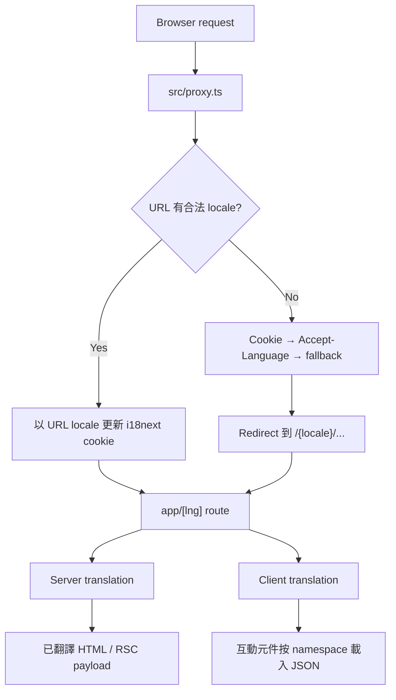

# i18n 架構說明

本專案使用 URL 子路徑表示語系，支援：

- `zh-TW`：繁體中文，也是 fallback locale
- `en`：英文

例如：

```text
/zh-TW
/zh-TW/post
/en
/en/post
```

## 核心原則

1. **URL locale 是目前頁面語系的主要來源。**
2. Proxy 負責缺少 locale 時的 redirect，以及將 URL locale 同步到 cookie。
3. Server Components 優先在伺服器完成翻譯，避免增加 Client JavaScript。
4. 只有需要互動的 Client Components 才使用 client i18next。
5. 語系資源使用明確的 import map，讓 Turbopack 可以靜態分析及拆包。

## 整體流程



## 資料夾結構

```text
src/i18n/
├── README.md
├── chrome.ts
├── client.ts
├── config.ts
├── cookie.ts
├── index.ts
├── resources.ts
├── types.ts
└── locales/
    ├── en/
    │   ├── common.json
    │   └── ...
    └── zh-TW/
        ├── common.json
        └── ...
```

Proxy 相關檔案位於：

```text
src/proxy.ts
src/middlewares/i18n.ts
```

## 檔案責任

### `config.ts`

i18n 與 MUI locale 的共用設定：

- `fallbackLng`
- `languages`
- `cookieName`
- `defaultNS`
- `getI18nextOptions()`
- `LOCALES`
- MUI locale mapping

新增支援語言時，必須同步更新 `languages`、`LOCALES` 與 MUI mapping。

### `types.ts`

定義專案允許的 `Locale` 與 `Namespace` union types。

這是 TypeScript 的單一型別來源；新增語言或 namespace 時必須同步更新。

### `resources.ts`

集中管理所有翻譯 JSON 的動態 import：

```ts
const RESOURCE_LOADERS = {
  en: {
    common: () => import("./locales/en/common.json"),
  },
  "zh-TW": {
    common: () => import("./locales/zh-TW/common.json"),
  },
};
```

這裡刻意不使用：

```ts
import(`./locales/${lng}/${namespace}.json`);
```

明確路徑讓 Turbopack 能精確建立 module graph，避免擴大可能載入的檔案範圍。

### `index.ts`

Server Components 使用的翻譯入口。

每次呼叫會建立獨立的 i18next instance，避免不同 SSR request 共用可變語言狀態：

```tsx
import { getServerTranslation } from "@/i18n";

export default async function Page({ params }: PageProps<"/[lng]">) {
  const { lng } = await params;
  const { t } = await getServerTranslation(lng, "common");

  return <h1>{t("site_name")}</h1>;
}
```

Server translation 不會將完整 i18next runtime 傳到瀏覽器。

### `client.ts`

Client Components 使用的翻譯 hook：

```tsx
"use client";

import { useClientTranslation } from "@/i18n/client";

export default function Search() {
  const { t } = useClientTranslation("posts-page");

  return <input aria-label={t("search.label")} />;
}
```

目前語系直接取自 `useParams()` 的 `lng`，不再使用 browser language detector，避免 URL、cookie 與瀏覽器偏好互相競爭。

`client.ts` 目前仍會在 effect 中同步 locale cookie。Proxy 已能依 URL 同步 cookie，因此這段屬於可移除的重複保護，詳見「已知可簡化項目」。

### `chrome.ts`

這裡的 `chrome` 是 **Application Chrome**，不是 Google Chrome。

Application Chrome 指全站共用的外框 UI，例如：

- AppBar
- 導覽連結
- 語言與配色選單
- Footer

這些元件只需要少量固定文案，因此直接以 Server-safe 的靜態 JSON mapping 取得字串，再由 Root Layout 傳入 Client Components。

這可避免首頁只為了幾個按鈕文字，就載入完整 client i18next runtime。

若未來重新命名，建議使用較直觀的 `layout-translations.ts`。

### `cookie.ts`

封裝 Client event 中的 locale cookie 寫入：

```ts
persistLocaleCookie(locale);
```

封裝的目的是避免 React Component 直接修改 `document.cookie`，觸發 React Compiler 的 immutability lint。

目前 Proxy 已會依目標 URL locale 更新 cookie，因此這層也是可移除的重複保護。

### `locales/`

翻譯檔依 locale 與 namespace 分組：

```text
locales/{locale}/{namespace}.json
```

目前 namespaces：

- `common`
- `component`
- `auth`
- `auth-page`
- `home-page`
- `nav-links`
- `posts-page`
- `user-page`

不同語言的相同 namespace 應保持一致的 key 結構。

## Proxy 與 cookie

`src/middlewares/i18n.ts` 負責兩種情況。

### URL 沒有合法 locale

依序使用：

1. `i18next` cookie
2. `Accept-Language` header
3. `fallbackLng`

然後 redirect：

```text
/post → /zh-TW/post
```

### URL 已有合法 locale

URL 是唯一真相，Proxy 會將 cookie 更新成 URL locale：

```text
/en/post → i18next=en
```

不要使用 `Referer` 決定新頁面的 locale。Referer 代表上一頁，語言切換時可能將 cookie 改回舊語系。

## Server 與 Client 的選擇

優先使用 Server translation：

```text
需要 state、event、browser API？
├── No  → getServerTranslation()
└── Yes → useClientTranslation()
```

即使元件需要互動，也可以由 Server Component 只傳入必要翻譯字串：

```tsx
<LoginButton label={t("login")} />
```

這通常比讓整個互動元件載入 client i18next 更輕。

## 語言切換

`LangSwitcher` 會保留目前 pathname 與 search params，只替換第一個 locale segment：

```text
/zh-TW/post?page=2 → /en/post?page=2
```

頁面導向新 URL 後，Proxy 會將 cookie 同步成新的 locale。

## 新增 namespace

假設新增 `settings-page`：

1. 在 `types.ts` 的 `Namespace` 加入 `"settings-page"`。
2. 建立所有語言的 JSON：

   ```text
   locales/en/settings-page.json
   locales/zh-TW/settings-page.json
   ```

3. 在 `resources.ts` 為每個 locale 加入明確 loader。
4. Server Component 使用 `getServerTranslation(lng, "settings-page")`。
5. Client Component 使用 `useClientTranslation("settings-page")`。
6. 執行 TypeScript、build 與相關 E2E 測試。

## 新增語言

假設新增 `ja`：

1. 將 `ja` 加入 `types.ts` 的 `Locale`。
2. 更新 `config.ts` 的 `languages` 與 `LOCALES`。
3. 更新 MUI locale mapping。
4. 建立 `locales/ja/`，補齊所有 namespaces。
5. 在 `resources.ts` 加入 `ja` 的所有 loaders。
6. 若 Application Chrome 仍採靜態 mapping，在 `chrome.ts` 加入 `ja`。
7. 更新 `generateStaticParams()` 所使用的語言清單。
8. 補充 locale switch E2E case。

## 效能與 React Compiler 注意事項

- 不要在 render 期間呼叫 `i18n.changeLanguage()`。
- 不要在 render 期間讀寫 `document.cookie`、`ref.current` 或其他全域可變狀態。
- cookie、navigation 等副作用應發生在 event、effect 或 Proxy 中。
- Server Components 優先，減少 client i18next runtime。
- 動態 import 必須使用明確可分析的路徑。
- 傳給 Client Components 的翻譯 props 應只包含真正使用的 primitive strings。

## 驗證指令

```bash
pnpm tsc
pnpm lint
pnpm build
pnpm test:e2e
pnpm next experimental-analyze --output
```

Locale switch E2E 應確認：

- URL locale 正確切換。
- 對應語言內容已顯示。
- `i18next` cookie 與 URL locale 一致。

## 已知可簡化項目

目前有三個位置能影響 locale cookie：

1. `LangSwitcher` 透過 `cookie.ts` 寫入。
2. `client.ts` 的 effect 寫入。
3. Proxy 依 URL locale 寫入。

現在 Proxy 已以 URL 作為唯一真相，因此前兩項屬於重複保護。後續可移除 `cookie.ts` 與 `client.ts` 的 cookie effect，讓流程收斂為：

```text
URL locale → Proxy 更新 cookie → Server/Client 依 URL 翻譯
```

進行這項簡化後，應重新執行 locale switch E2E，確認兩個方向的切換與 cookie 持久化都通過。
